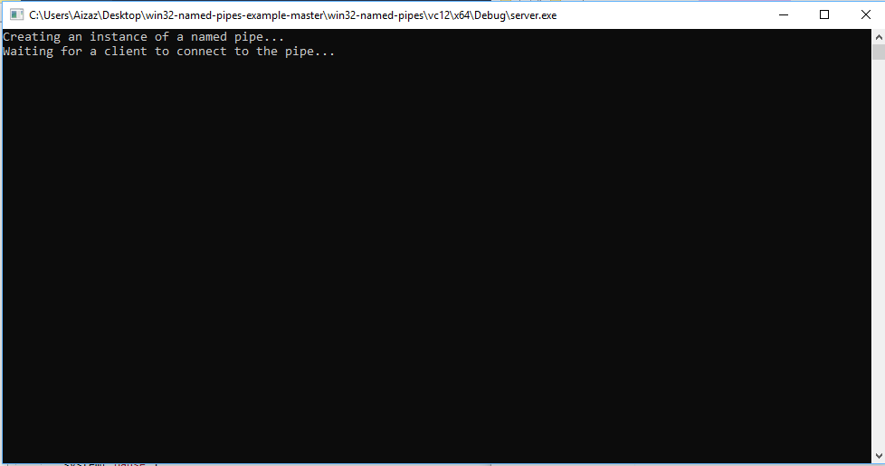
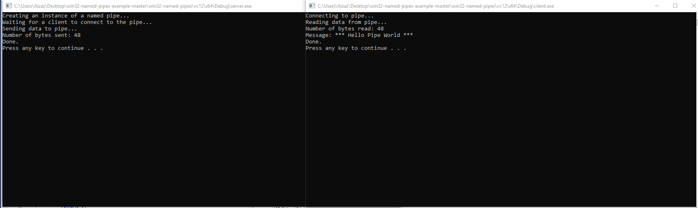

# named-pipes-using-win32-c++

C++ example implementation of named pipes using WIN32 API on windows platform. This code is for a single client and server using synchronous calls.

Example output on a console.





## Installation and Usage

* Install 
  * Visual Studio (latest version)
* Clone the repo and go to directory


```
$ git clone https://github.com/AizazSharif/named-pipes-win32.git
$ cd named-pipes-win32

```
* Run 'win32-named-pipe.sln' under vc12 directory to open the project.
* Build the project after you go through client.cpp and server.cpp.
* Run 'vc12/x64/Debugserver.exe' and then 'vc12/x64/Debug/client.exe'. 


## Credit 

This project is a part of a coding Challenge and learning purpose. Main help of named pipes in c++ is taken by this [blog](http://avidinsight.uk/2012/03/introduction-to-win32-named-pipes-cpp/). 

